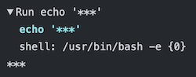

# :warning: DEPRECATED

This action is deprecated. Use [configuration variables](https://docs.github.com/en/actions/learn-github-actions/variables#defining-configuration-variables-for-multiple-workflows) instead.

# Action Config

GitHub Actions for providing configuration values to your workflows.

Prepare a `.github/workflows/.config` file in your repository.

  ```
  # describe any key and value
  your_key1 = your_value1
  your_key2 = your_value2
  ```  

Use in your GitHub Actions workflow.

  ```yaml
  - uses: yumemi-inc/action-config@v0
    id: config
  - run: |
      value1='${{ steps.config.outputs.your_key1 }}'
      value2='${{ steps.config.outputs.your_key2 }}'
      ...
  ``` 

## Inputs

All inputs for this action are **optional**, so specify only the inputs for which you want to change the behavior.

### `config-path`

The path to the configuration file to apply. 
By default, `.github/workflows/.config` is applied.

### `repository`

The repository name where the configuration file is stored, eg `yumemi-inc/some-repository`.
By default, the same repository as the workflow is applied.

### `ref`

The commit/branch/tag name of the configuration file to apply.
By default, the repository’s default branch is applied (usually `main`).

### `github-token`

Specify a token with permissions when applying the configuration file of another private repository.

### `mask-variables`

By default, configuration values are masked on the GitHub Actions log screen.



Specify `false` if you don't want to mask.

## License

[MIT](LICENSE)
